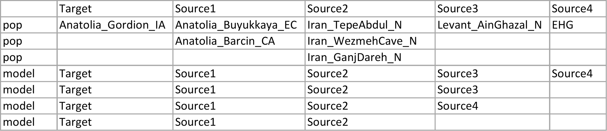

# qpAdm-wrapper

A wrapper to estimate admixture proportions using qpAdm implemented in [AdmixTools](https://github.com/DReichLab/AdmixTools)

*qpAdm-wrapper* has two modes:
- **write**: to generate input files for qpAdm analysis that included all combinations of target, source and right populations and list all results 
- **read**: to read all log files produced by qpAdm and evaluate them based on p-value and Z scores.

Assume we have a target population (Anatolia_Gordion_IA) that we want to estimate admixture populations by using the different numbers of sources (2,3 or 4) with various possible ancestry sources from the same gene pool (i.e. to explain Anatolian-related ancestry in the target population "Anatolia_Gordion_IA", we want to use either Anatolia_Buyukkaya_EC or Anatolia_Barcin_CA) as below. To run all possible combinations of target and source populations by using Admixtools, we have to create 23 different left files and 23 different par files. When we want to model more than one target population the number of required input files will increase.

```
Anatolia_Gordion_IA     Anatolia_Buyukkaya_EC   Iran_TepeAbdul_N
Anatolia_Gordion_IA     Anatolia_Buyukkaya_EC   Iran_WezmehCave_N
Anatolia_Gordion_IA     Anatolia_Buyukkaya_EC   Iran_GanjDareh_N
Anatolia_Gordion_IA     Anatolia_Barcin_CA      Iran_TepeAbdul_N
Anatolia_Gordion_IA     Anatolia_Barcin_CA      Iran_WezmehCave_N
Anatolia_Gordion_IA     Anatolia_Barcin_CA      Iran_GanjDareh_N
Anatolia_Gordion_IA     Anatolia_Buyukkaya_EC   Iran_TepeAbdul_N        EHG
Anatolia_Gordion_IA     Anatolia_Buyukkaya_EC   Iran_WezmehCave_N       EHG
Anatolia_Gordion_IA     Anatolia_Buyukkaya_EC   Iran_GanjDareh_N        EHG
Anatolia_Gordion_IA     Anatolia_Barcin_CA      Iran_TepeAbdul_N        EHG
Anatolia_Gordion_IA     Anatolia_Barcin_CA      Iran_WezmehCave_N       EHG
Anatolia_Gordion_IA     Anatolia_Barcin_CA      Iran_GanjDareh_N        EHG
Anatolia_Gordion_IA     Anatolia_Buyukkaya_EC   Iran_TepeAbdul_N        Levant_AinGhazal_N
Anatolia_Gordion_IA     Anatolia_Buyukkaya_EC   Iran_WezmehCave_N       Levant_AinGhazal_N
Anatolia_Gordion_IA     Anatolia_Buyukkaya_EC   Iran_GanjDareh_N        Levant_AinGhazal_N
Anatolia_Gordion_IA     Anatolia_Barcin_CA      Iran_TepeAbdul_N        Levant_AinGhazal_N
Anatolia_Gordion_IA     Anatolia_Barcin_CA      Iran_WezmehCave_N       Levant_AinGhazal_N
Anatolia_Gordion_IA     Anatolia_Barcin_CA      Iran_GanjDareh_N        Levant_AinGhazal_N
Anatolia_Gordion_IA     Anatolia_Buyukkaya_EC   Iran_TepeAbdul_N        Levant_AinGhazal_N      EHG
Anatolia_Gordion_IA     Anatolia_Buyukkaya_EC   Iran_WezmehCave_N       Levant_AinGhazal_N      EHG
Anatolia_Gordion_IA     Anatolia_Buyukkaya_EC   Iran_GanjDareh_N        Levant_AinGhazal_N      EHG
Anatolia_Gordion_IA     Anatolia_Barcin_CA      Iran_TepeAbdul_N        Levant_AinGhazal_N      EHG
Anatolia_Gordion_IA     Anatolia_Barcin_CA      Iran_WezmehCave_N       Levant_AinGhazal_N      EHG
Anatolia_Gordion_IA     Anatolia_Barcin_CA      Iran_GanjDareh_N        Levant_AinGhazal_N      EHG

```

qpAdm-wrapper can prepare all these input files and produce a script file (either in sbatch or bash format) to run multiple qpAdm models using multiple threads from a simple input file ([info file](examples/input_files/gordion)) like below. 



This info file should be prepared as a data frame that has two indexes called 'pop' and 'model'. The rows containing information about 'left' populations are indexed as 'pop', while the rows containing the model are indexed as 'model'. The header of dataframe (column names) indicates target and possible ancestry sources. Column names can be changed, but the first column should always contain target population(s).

The info file should be tab-separeted and can contain empty cells. However, empty cells could be filled by ```NA```'s to avoid confusion.
## dependencies

### softwares
- [AdmixTools](https://github.com/DReichLab/AdmixTools)

You could give Admixtools bin path by using ```--admixtools_path``` option. 

### python packages
- numpy
- pandas
- argparse
- os
- itertools

### required input files
- base par file (see [example par file](examples/input_files/par))
- population info file (see [example info file](examples/input_files/gordion))

## options

```bash
-i    --input             <filename>      "Input file contains information about target and sources populations and models"
-o    --outgroup_name     <filename>      "The file contains a list of the right populations (1 per line) "
-p    --par               <filename>      "base par file"
-w    --write             <BOOL>          "write mode [default: True], when read mode is True [default: False]"
-r    --read              <BOOL>          "read mode [default: False]"
--run_mode                <STR>           "Output script file could be either in sbatch or bash format [default: sbatch]"
--admixtools_path         <STR>           "path of the Admixtools bin"
-t    --threads           <INT>           "number of threads"
-ho   --host_name         <STR>           "if the run_mode is sbatch, partition/queue in which to run the job"    
--out_path                <STR>           "the directory where output files are written"
```

## run examples

### write

#### sbatch file as output

```bash
./qpAdm-wrapper.py -i gordion -p par -o Base12_CHG -ho chimp -t 80 
```
The header of sbatch output file will be like below:

```
#!/bin/bash -l
#SBATCH -J qpAdm 
#SBATCH -p chimp # can be specified by -ho option
#SBATCH -n 80 # can be specified by -t option
#SBATCH -t 5-00:00:00
#SBATCH -D ./  can be specified by --out_path option 
#SBATCH -o slurm-%j-%N-%u.out
#SBATCH -e slurm-%J-%N-%u.err
export PATH=$PATH:/usr/local/sw/AdmixTools-7.0.2/bin/ # can be specified by --admixtools_path option
```

If your cluster uses different slurm configurations or specifies options differently, you can modify the ```create_sbatch``` function in the script. Or you should modify the sbatch output file manually. You can also create bash file as output and define options during submitting. For more detail you can check [slurm-sbatch](https://slurm.schedmd.com/sbatch.html) website.


#### bash file as output

```bash
./qpAdm-wrapper.py -i gordion -p par -o Base12_CHG --run_mode bash -t 80 
```

### read

To summarize results from all log files after qpAdm runs have finished

```bash
./qpAdm-wrapper.py -i gordion -p par -o Base12_CHG -r True
```

This create the output file named ```results_poplist_gordion.txt``` 

You can copy and paste results to the excel file in ```examples/output_files/qpAdm_results_template.xltx```, you can easily compare all results by checking ```feasible``` and ```z_eval``` columns.
